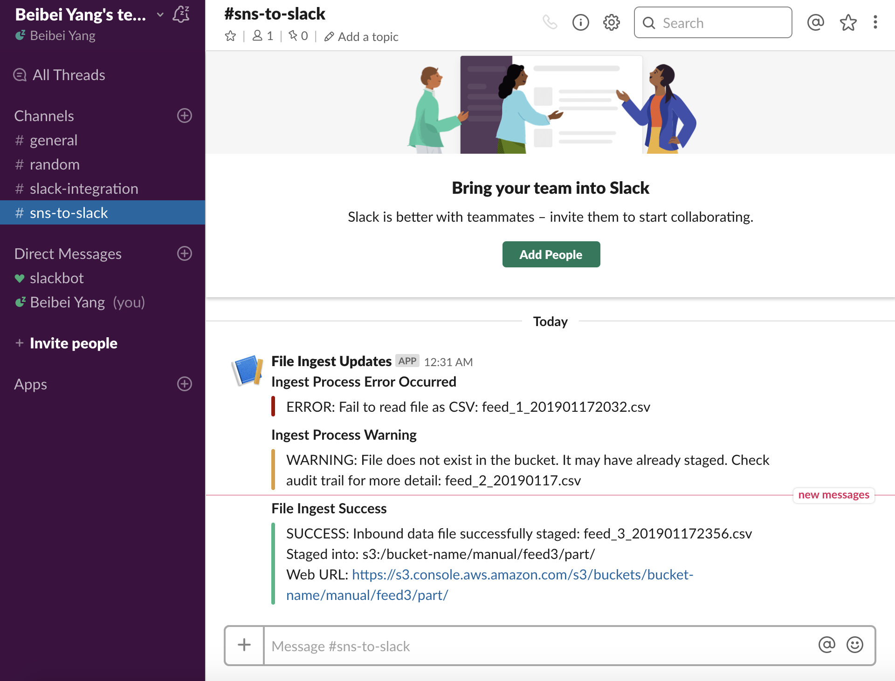

# SNS to Slack

SNS to Slack is a Serverless Lambda function written in both Node.js and Python for 
posting tiered SNS messages to Slack.

Architecture:


* Features
  * Choose either Node.js or Python
  * Deployed with the [Serverless framework](http://serverless.com/) to AWS
  * The Lambda function is triggered by SNS events
  * Read SNS Notifications of any events
  * Post SNS messages to your designated Slack channel
  * Support of `ERROR`, `WARNING` and `SUCCESS` messages and show them in Red, Yellow and Green

Tiered SNS Messages in Slack: 


* Follow these steps to configure a webhook in Slack:
  * Navigate to either `https://<your-team>.slack.com/apps` or [https://api.slack.com/incoming-webhooks](https://api.slack.com/incoming-webhooks)
  * Select "Incoming WebHooks"
  * Click the "Create your Slack app" button and follow the wizard to complete the creation of your new app. 
  * Activate incoming webhooks for your app in the config page
  * Click on "Add New Webhook to Workspace" and choose the default channel where SNS messages should be sent and click "Add Incoming WebHooks Integration".
  * Copy the Webhook URL from the setup instructions and paste it into config file (`config.js` for Node.js or `lambda.cfg` for Python)

* Caution:
  * The Lambda function must be set up to be triggered by SNS. 
  * Each SNS message's message body must start with `ERROR`, `WARNING` or `SUCCESS`

## How to Deploy Lambda Functions to AWS with the Serverless Framework

### Deploy the Python version
* Prerequisites:
  * Python 2.x / 3.x or Anaconda Python 2.x / 3.x
  * Python virtual environment (such as virtualenv or conda)
* Install [node.js and npm](https://nodejs.org/en/)
* Install Docker
* Install Serverless: `npm install -g serverless`
* Initialize NPM: `npm init`
* Install Serverless Python Requirements: `npm install --save serverless-python-requirements`
* `$ cd python`
* Update `lambda.cfg` and `serverless.yml`
* Deploy Lambda:
```shell
export AWS_ACCESS_KEY_ID=<YOUR_AWS_ACCESS_KEY_ID>
export AWS_SECRET_ACCESS_KEY=<YOUR_AWS_SECRET_ACCESS_KEY>
serverless deploy
```
* Follow [this guide](https://serverless.com/blog/serverless-python-packaging/) to package Python in Lambda with Serverless plugins:
  
### Deploy the node.js version
* Prerequisites:
  * Install [node.js and npm](https://nodejs.org/en/download/)
  * Install [Serverless Framework](http://serverless.com/) - Follow along step 1-3 of [this reference](https://hackernoon.com/a-crash-course-on-serverless-with-node-js-632b37d58b44#422a).
* `$ cd nodejs`
* Update `config.js` and `serverless.yml`
* Deploy Lambda:
```shell
export AWS_ACCESS_KEY_ID=<YOUR_AWS_ACCESS_KEY_ID>
export AWS_SECRET_ACCESS_KEY=<YOUR_AWS_SECRET_ACCESS_KEY>
serverless deploy
```
* Follow [this guide](https://dev.to/adnanrahic/how-to-deploy-a-nodejs-application-to-aws-lambda-using-serverless-2nc7) to package Nodejs in Lambda with Serverless plugins

## Reference

* Serverless.yml Reference
  * https://serverless.com/framework/docs/providers/aws/guide/serverless.yml/
* How to Handle your Python packaging in Lambda with Serverless plugins
  * https://serverless.com/blog/serverless-python-packaging/
* How to deploy a Node.js application to AWS Lambda using Serverless
  * https://dev.to/adnanrahic/how-to-deploy-a-nodejs-application-to-aws-lambda-using-serverless-2nc7